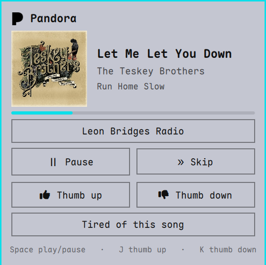

# Pandora for the Omarchy bar

Pandora station radio as an [Omarchy](https://omarchy.org) shell plugin.
A **P** in the bar opens a card with now playing, play/pause, skip, thumbs
up/down, "tired of this song", and a station picker. Audio keeps playing
when the card closes and across shell restarts.



Built for Omarchy's Quickshell-based shell. Text and borders follow the
active theme.

## Requirements

- Omarchy with the bar plugin system (`omarchy plugin` commands)
- `python` with `python-requests`
- `mpv`
- `libsecret` (`secret-tool`) and a running keyring, which Omarchy has by
  default. The password is stored there once and reused for autologin.
- A Pandora account

## Install

```sh
omarchy plugin add https://github.com/AlturaTechnology/omarchy-pandora --enable
```

Then bind a key in your Hyprland config. Use the shell's routed toggle so
the card opens on the focused monitor:

```lua
o.bind("SUPER + SHIFT + M", "Pandora", "omarchy-shell shell toggle alturatechnology.pandora")
```

## Use

- Click the bar icon or press your key to open the card
- Middle-click the icon to play/pause without opening it
- In the card: Space play/pause, J thumb up, K thumb down, Esc close
- Sign in once. The password goes in the system keyring; the engine signs
  in by itself on later starts

Other IPC commands, for scripts or extra keybindings:

```sh
omarchy-shell alturatechnology.pandora play
omarchy-shell alturatechnology.pandora pause
omarchy-shell alturatechnology.pandora skip
omarchy-shell alturatechnology.pandora thumbUp
omarchy-shell alturatechnology.pandora thumbDown
```

## How it works

- `bin/pandora-engine` is a small Python daemon. It talks to Pandora's
  **unofficial** web API, plays audio through `mpv`, and serves
  newline-delimited JSON over a Unix socket in `$XDG_RUNTIME_DIR`.
- `Service.qml` is the socket client the shell loads once.
- `BarWidget.qml` and `Popover.qml` are the icon and the card.

Logs and saved state live in `~/.local/state/alturatechnology.pandora/`.

## Caveats

- This uses the same private API as the Pandora website. It is not
  supported by Pandora and may stop working if they change it.
- Pandora allows one stream per account at a time. Starting playback here
  takes over from the website or app, and vice versa.
- Pandora is US-only.

## Development

See [CLAUDE.md](CLAUDE.md) for the architecture, threading model, socket
protocol, and how to verify changes against a live shell.

## License

MIT. See [LICENSE](LICENSE).
